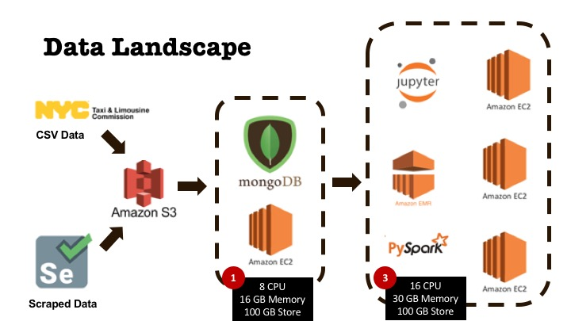

## Taxi Cab Spark Analysis




This repository is the home of the analysis scripts used for analyzing 50M+ NYC taxi trips from 2017. There are two files. The first is for importing data into mongo

```
mongo-ec2$bash s3-to-mongo.sh
```

#### Clean up the taxi data
```
mongo-ec2$create-mongo-db
```

#### Create a collections for 1M, 3M, 11M, 30M:
```
### TBD
```

The second is the pyspark EMR server setup script:


#### Connection Notes:
Once the spark server is up and running, install jupyter notebook and get the remote server runnning.
 
```
spark-server$bash setup_spark_EMR.sh
```

Then finally tunnel through the ssh access the EMR spark instance.
```
ssh -L localhost:8890:localhost:8888 hadoop@<aws master node>
```

The third is the spark notebook: [link](master_spark_notebook.ipynb)


